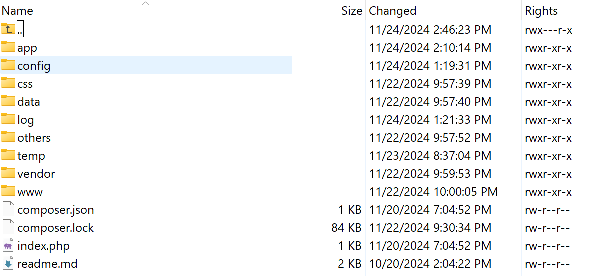
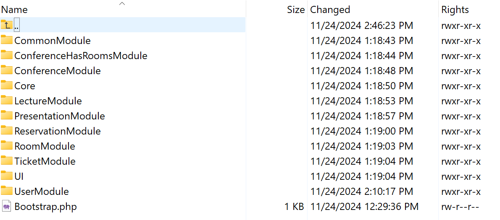

# IIS Project: Information System for Conferences
- Authors: Tomáš Dolák, Monika Zahradníková, Jan Křůmal
- Logins: [xdolak09](https://www.vut.cz/lide/tomas-dolak-247220), xzahra33, xkruma1
- Emails: <xdolak09@stud.fit.vutbr.cz>, <xzahra33@stud.fit.vutbr.cz>, <xkruma01@stud.fit.vutbr.cz>

The goal of this project in the subject Information System was to create a information system for conferences. The `README` contains a brief description of the project installation, for more information see `doc.html` in the root directory of the project, this documentation file in Czech describes the project in more detail.

## Installation Guide

### Installation on a Local Enviroment

#### Procedure

1. Save the project to any folder.

2. Run the command composer install in the folder ...\iis-proj\src\.

3. Start the Apache server and MySQL in XAMPP.

4. In your browser, open [http://localhost/phpmyadmin/index.php](http://localhost/phpmyadmin/index.php), and click the "New" button to create a new database.

5. Name the new database "iis" and then import the schema from the file ...\iis-proj\src\data\db.sql.

6. Open the Windows terminal and run a local PHP server in the folder `...\iis-proj\src\` using the command: `php -S localhost:8000 -t www`.

7. Then open the URL: [http://localhost:8000/](http://localhost:8000/) in your browser.

8. The application has been tested on PHP 8.2, using XAMPP (running Apache Server and MySQL), and utilizing a PHP server (php -S localhost:8000 -t www).

### Installation on a Server

#### Requirements
Apache or Unix server, MySQL, Composer 2.8.1, PHP version 8.2

#### Procedure
1. In phpMyAdmin on the server, create a new database.

2. Import the schema from the file `...\iis-proj\src\data\db.sql` into the database.

3. Edit the database settings in `...\iis-proj\src\config\common.neon`, e.g., for the server "Eva":

```
database:
  dsn: 'mysql:unix_socket=/var/run/mysql/mysql.sock;dbname=DBNAME'
  user: 'username'
  password: '******'
```

4. Upload the contents of the `src` folder to the server's web directory.

5. Run the command `composer install`.

6. Now the application is accessible from the given URL on server "Eva" - in our case: [https://www.stud.fit.vutbr.cz/~xzahra33/IIS/](https://www.stud.fit.vutbr.cz/~xzahra33/IIS/).

7. The content of the `WWW` folder on the server should look like this:

<p align="center">
  <br>
  <em>Content of WWW directory</em>
</p>


8. The content of the `WWW/app` folder on the server should look like this:

<p align="center">
  <br>
  <em>Content of WWW/app directory</em>
</p>

- **Note**: The WWW directory (and index.phph) must be set with sufficient rights! set the rights: chmod -R o=rX,g= ~/WWW (i.e. read and pass rights for all, but disabled write, no rights for the group). For more information see [FIT: Frequently Asked Questions](https://www.fit.vut.cz/units/cvt/faq/.cs)